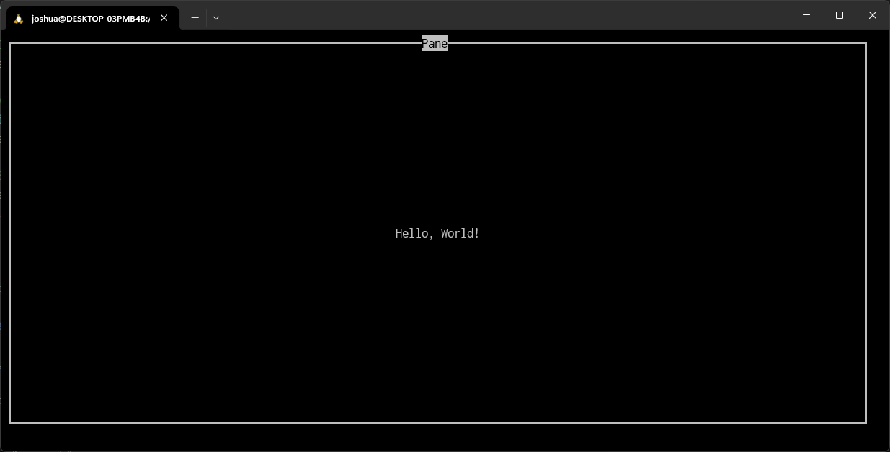

# Panes

Panes is a (WIP) single-header TUI framework for C.

## Example

A simple hello world:

```c
// Compile this example with the following command:
// gcc helloworld.c -lncurses -lm

// Only a single header file.
#include "panes.h"

int main(void) {
    // Initialize panes.
    panes_init();

    // Create a new pane to fill the terminal and have the title "Pane",
    // also allow the user to break with ^C.
    Pane *pane = create_pane(MAX_WIDTH, MAX_HEIGHT, 0, 0, "Pane", BREAK_WITH_CTRL_C);

    // Create a new label with the text "Hello, World!" in the center.
    Label *text = create_label(CENTER, CENTER, "Hello, World!");
    // Pack this into the pane to be drawn on the next update.
    pack_widget(pane, text);

    // Draw all packed widgets onto the pane.
    update_pane(pane);

    // Wait for a keypress then delete the pane.
    await_keypress(pane);
    delete_pane(pane);

    // Stop panes.
    panes_end();
    return 0;
}
```



## Usage

Firstly, make sure you have ```ncurses``` installed on your system.

Then, download the [header file](./panes.h) and include it into your project.

```c
#include "panes.h"
```

Make sure to link your programs with the ncurses and math libraries by adding ```-lncurses -lm``` onto the end of your compilation commands.

## Documentation

Coming soon.

## License

Panes is distributed under the [MIT](./LICENSE) license.
